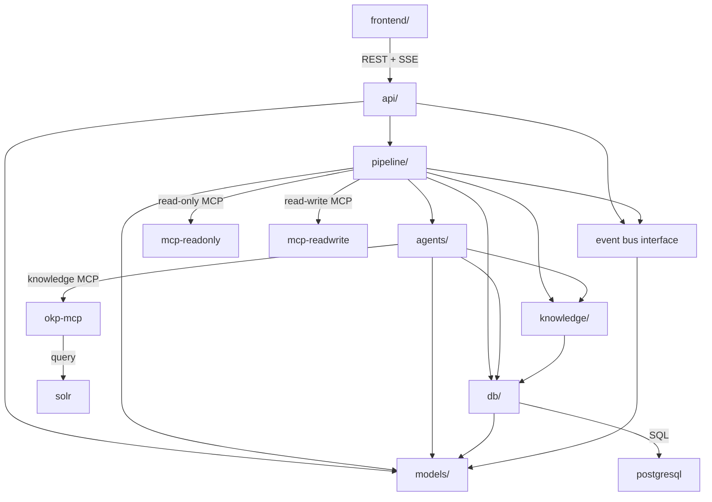
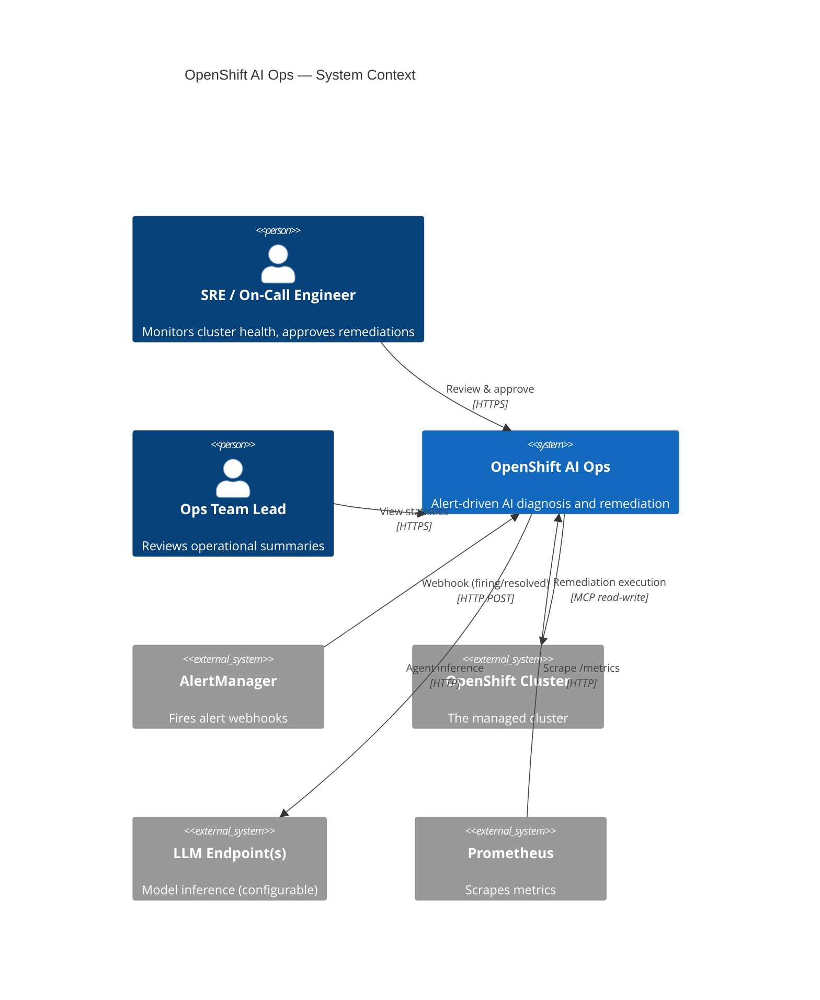
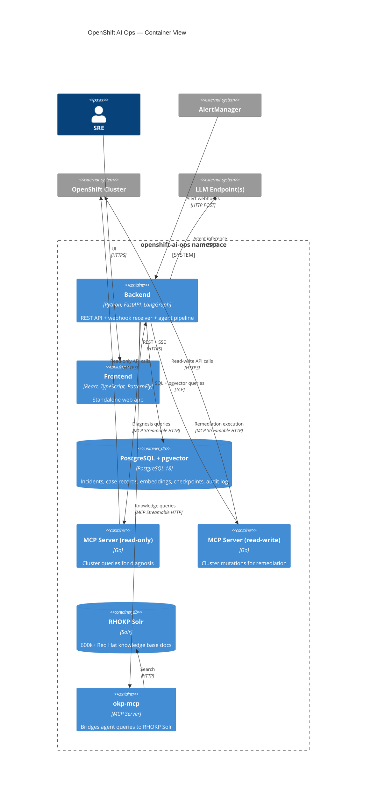
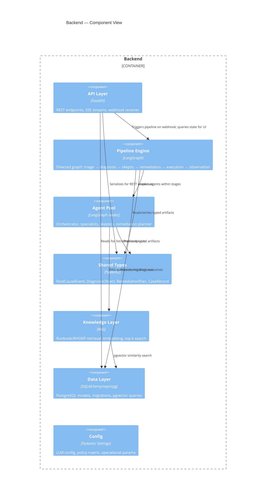
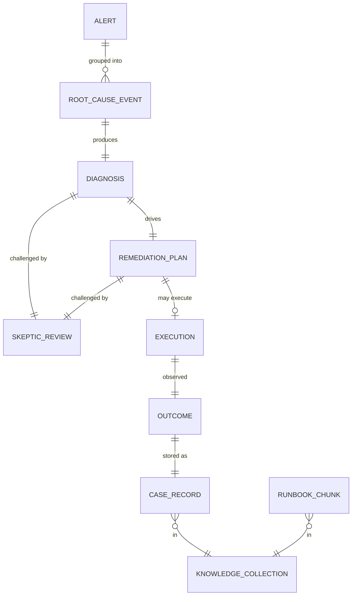
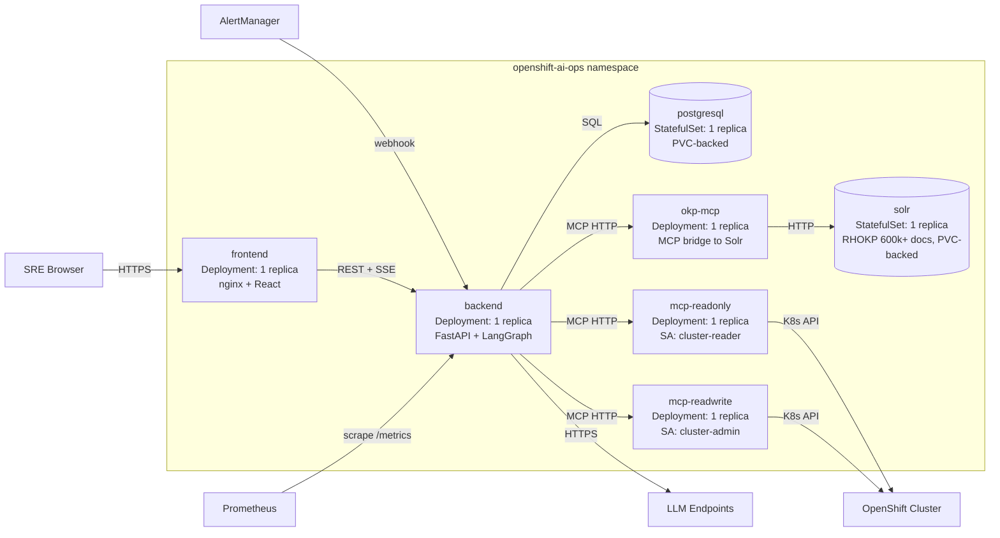
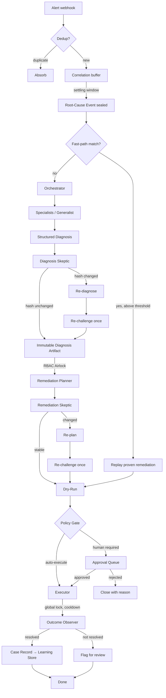

# Architecture Spine — OpenShift AI Ops

## Design Paradigm

**Staged pipeline.** The system is a directed pipeline of typed stages:

```
alert → triage/correlate → diagnosis → skeptic → remediation planning → skeptic → dry-run → policy gate → execution → observation → learning
```

Each stage accepts a typed artifact and produces a typed artifact for the next. LangGraph's directed graph is the runtime expression — stages are graph nodes, transitions are edges, conditional paths (fast-path bypass, re-challenge loops) are conditional edges within the same graph.

Agent orchestration (orchestrator dispatching to specialists, skeptic challenge/response) is **internal** to the diagnosis and validation stages. It is not a system-level pattern. The pipeline contract is the stage boundary artifacts; agents are implementation details within stages.

The **RBAC Airlock** is a hard stage boundary between diagnosis and remediation — an immutable diagnosis artifact crosses it, and separate ServiceAccounts enforce the read/write split.

## Invariants & Rules

### AD-1 — Staged pipeline paradigm [ADOPTED]

- **Binds:** all features, all pipeline stages
- **Prevents:** stages built as loosely-coupled event subscribers with unclear ordering; agent internals leaking into pipeline contracts
- **Rule:** every pipeline stage has typed input/output contracts defined in the shared types module. Agent orchestration (orchestrator, specialists, skeptics) lives inside stages, never between them. Fast-path and re-challenge are conditional edges in the graph, not a different paradigm.

### AD-2 — RBAC Airlock: cluster-reader / cluster-admin

- **Binds:** FR-10, FR-12, FR-15, NFR §7.1
- **Prevents:** diagnosis agents writing to the cluster; remediation re-diagnosing; permission gaps blocking incident response
- **Rule:** two ServiceAccounts — `cluster-reader` (diagnosis MCP Server, `--read-only` flag) and `cluster-admin` (remediation MCP Server). Default is `cluster-admin` for remediation because actions are not knowable in advance. Helm values expose SA/ClusterRoleBinding as configurable for teams that want tighter RBAC. Dry-run pre-flight (FR-12) catches permission gaps regardless.

### AD-3 — Two schema domains in PostgreSQL

- **Binds:** FR-18, FR-19, FR-20, FR-31, NFR §7.2
- **Prevents:** coupling application queries to LangGraph internals; LangGraph upgrades breaking application schema
- **Rule:** LangGraph owns `langgraph_*` tables (black box — no application queries). Everything else (incidents, priority queue, case records, vector embeddings, semantic cache, audit log, policy config) is application schema managed by application-owned migrations. Pipeline stages access whatever application tables they need.

### AD-4 — Shared types module is the pipeline contract

- **Binds:** FR-5, FR-10, FR-11, FR-18, all stage boundaries
- **Prevents:** incompatible artifact shapes between stages; schema drift when one stage evolves independently
- **Rule:** all stage-boundary artifacts (Root-Cause Event, Structured Diagnosis Object, Immutable Diagnosis Artifact, Remediation Plan, Case Record) defined in `backend/src/models/`. All stages import from it. Structured schema fields coexist with unstructured text fields (LLM-produced reasoning, prose summaries) — both are first-class parts of the typed artifact.

### AD-5 — Deterministic pre-agent alert correlation

- **Binds:** FR-2, FR-3
- **Prevents:** duplicate diagnosis pipelines for symptoms of one failure; conflicting remediations for the same root cause; LLM cost on correlation decisions
- **Rule:** correlation is a deterministic triage stage (no LLM). Five-layer correlator, in order:
  1. **Dedup** — same fingerprint already processing → absorb
  2. **Namespace + temporal proximity** — sufficient pair
  3. **Label overlap** (node/instance/component) **+ temporal proximity** — sufficient pair
  4. **Static subsystem dependency graph** — known OpenShift cascade patterns → sufficient alone
  5. **Learning Store co-occurrence** — empirical patterns from past Case Records → strongest signal

  Over-grouping preferred — the orchestrator refines during diagnosis. Output: Root-Cause Event artifact containing all grouped alerts + correlation evidence.

### AD-6 — Severity-based correlation settling windows

- **Binds:** FR-2, FR-3
- **Prevents:** critical alerts waiting behind slow cascades; low-severity storms sealing too fast
- **Rule:** settling window by highest-severity member: Critical=60s, Warning=5min, Info=10min (Helm-configurable). Group inherits shortest window of any member (severity escalates, never downgrades). Timer resets on each new alert joining. Max group age = 3× settling window.

### AD-7 — Per-agent LLM config with layered override

- **Binds:** FR-28, FR-29, FR-30, FR-31
- **Prevents:** unnecessary internal gateway service; conflicting configuration paths with no merge semantics
- **Rule:** each agent role has its own LLM client configured with endpoint, model, and params. Configuration layers: (1) Helm values provide the initial seed, (2) runtime API mutations are persisted to the application DB and take precedence over Helm values, (3) on pod restart, Helm defaults load first then DB-stored overrides are applied. All runtime config changes are audit-logged. Model routing is a wrapper selecting config by task complexity. Semantic cache is a middleware layer intercepting calls. Retry with exponential backoff is per-client.

### AD-8 — Python backend, React+TypeScript frontend

- **Binds:** all backend features, FR-21, FR-22
- **Prevents:** fighting the LangGraph/LLM ecosystem; splitting the backend across languages
- **Rule:** backend is Python (FastAPI + LangGraph). Frontend is React + TypeScript + PatternFly (settled by UX spine). MCP Server is Go (external binary, not our code).

### AD-9 — Seven-deployment pod topology

- **Binds:** FR-6, FR-27, NFR §7.1, NFR §7.2
- **Prevents:** unnecessary pod count; split-brain between API and pipeline state; RHOKP coupling to main backend process
- **Rule:** seven Deployments/StatefulSets in a single namespace:
  1. **backend** — FastAPI REST API + webhook receiver + LangGraph pipeline (one Python process)
  2. **frontend** — React/PatternFly static app (nginx)
  3. **postgresql** — PostgreSQL 18 + pgvector (StatefulSet, PVC-backed)
  4. **mcp-readonly** — kubernetes-mcp-server (`cluster-reader` SA, `--read-only`)
  5. **mcp-readwrite** — kubernetes-mcp-server (`cluster-admin` SA)
  6. **solr** — RHOKP Solr instance (600k+ docs, PVC-backed)
  7. **okp-mcp** — okp-mcp MCP server bridging agent queries to Solr

  MCP instances are separate deployments to enforce the RBAC Airlock via distinct ServiceAccounts. Backend communicates with MCP servers (kubernetes-mcp-server and okp-mcp) via **Streamable HTTP** transport (not stdio — stdio requires same-process; separate pods require network transport).

### AD-10 — SSE for real-time updates, path-versioned REST API

- **Binds:** FR-21, FR-33
- **Prevents:** polling latency on live pipeline transitions; header-negotiation complexity for API versioning
- **Rule:** FastAPI serves SSE endpoints for live pipeline stage transitions and incident state changes. Frontend subscribes on incident detail view, falls back to polling on connection drop. REST API at `/api/v1/` for all CRUD operations. URL-path versioning only.

### AD-11 — In-process observability

- **Binds:** NFR §7.4
- **Prevents:** sidecar complexity; non-standard log formats
- **Rule:** `/metrics` endpoint via `prometheus-client`. `ServiceMonitor` in Helm chart. Structured JSON logging to stdout. LangGraph tracing for agent execution traces (queryable via PostgreSQL checkpoints).

### AD-12 — OpenShift OAuth authentication [ADOPTED]

- **Binds:** FR-14, FR-33
- **Prevents:** custom auth diverging from Console plugin path; unauthenticated approval endpoints
- **Rule:** REST API validates bearer tokens against OpenShift OAuth server. Frontend uses OpenShift OAuth flow. Approval actions carry approver identity from token.

### AD-13 — Dual-path knowledge retrieval: pgvector RAG + RHOKP via MCP

- **Binds:** FR-6
- **Prevents:** runtime Git dependency; divergent retrieval patterns; RHOKP coupling to the main backend
- **Rule:** two knowledge retrieval paths:
  1. **Runbooks (pgvector RAG):** bundled at container build time (clone, chunk, embed, store in pgvector). Retrieved via similarity search with alert context, top-k chunks injected into agent prompts. Refresh cadence = image rebuild.
  2. **RHOKP (MCP):** deployed as Solr container (600k+ docs) + okp-mcp sidecar. Agents query RHOKP via MCP streamable-http transport to okp-mcp. Offline-capable, no external API dependency.

  Both are distinct from the case records table. Agentic skills (openshift/agentic-skills) loaded as callable tools, not RAG content.

### AD-14 — Monorepo source tree

- **Binds:** all
- **Prevents:** scattered schema definitions; agent code leaking into pipeline boundaries
- **Rule:** layout mirrors the paradigm:

```text
openshift-ai-ops/
  backend/
    src/
      api/          # REST routes, SSE endpoints, webhook receiver
      pipeline/     # LangGraph graph definitions, stage boundaries
      agents/       # Orchestrator, specialists, skeptics, planner (internal to stages)
      models/       # Shared typed artifacts — THE pipeline contract (AD-4)
      knowledge/    # RAG retrieval, embedding, knowledge indexing
      db/           # PostgreSQL models, migrations, pgvector queries
      config/       # Settings, LLM config, policy matrix
    tests/
  frontend/         # React + TypeScript + PatternFly
    src/
  charts/
    openshift-ai-ops/
      templates/
      values.yaml
  docs/
```

### Dependency direction



`models/` is a leaf — everything depends on it, it depends on nothing. `agents/` never imports from `api/` or `pipeline/` — stages invoke agents, not the reverse. The event bus interface lives in `models/` (emit/subscribe contract); `pipeline/` emits, `api/` subscribes.

### AD-15 — MCP timeout produces partial evidence, never silent omission

- **Binds:** FR-5, FR-13, NFR §7.2
- **Prevents:** silently incomplete diagnoses reaching auto-remediation
- **Rule:** MCP timeouts produce partial-evidence continuations. The Structured Diagnosis Object carries an `evidence_gaps` field listing queries that failed or timed out. The Skeptic must explicitly challenge any evidence gap. The Policy Gate blocks auto-execution when `evidence_gaps` is non-empty regardless of other matrix dimensions.

### AD-16 — Execution-stage freshness gate

- **Binds:** FR-15, FR-16
- **Prevents:** executing stale remediations after the problem resolved itself or a prior fix changed cluster state
- **Rule:** before executing a queued remediation, the execution stage re-validates that the originating alert is still firing and the diagnosis is still relevant. Stale remediations are skipped, and the diagnosis is stored as an informational case record. A `resolved` webhook arriving during an in-flight pipeline does **not** cancel the pipeline — the freshness gate catches it at execution. Diagnostic work is preserved for the Learning Store.

### AD-17 — Semantic cache invalidation via cluster-context fingerprint

- **Binds:** FR-31
- **Prevents:** stale cached diagnoses applied to a changed cluster
- **Rule:** semantic cache entries carry a cluster-context fingerprint (OCP version + topology hash). Cache hits are valid only when the current fingerprint matches the stored one. Staleness is detected at lookup time — no background reconciler.

### AD-18 — Global remediation lock via PostgreSQL row-level lock

- **Binds:** FR-15
- **Prevents:** two epics implementing conflicting lock mechanisms for serialized execution
- **Rule:** the global remediation lock is a row-level lock (`SELECT FOR UPDATE NOWAIT`) on a dedicated `remediation_locks` table. Single row per namespace, acquired before execution, held through outcome observation + cooldown, then released. Survives pod restart (lock auto-releases on connection drop; next pod acquires cleanly). No advisory locks, no in-memory locks — row-level lock in PostgreSQL only. Cooldown timer is configurable via Helm values.

### AD-19 — Canonical incident state machine

- **Binds:** FR-1, FR-3, FR-14, FR-15, FR-16, FR-21
- **Prevents:** triage, remediation, and API epics defining incompatible lifecycle states for the same entity
- **Rule:** every incident follows one state machine, defined in the shared types module (AD-4):

```
received → correlating → queued → diagnosing → diagnosed → awaiting_approval → executing → observing → resolved | failed
```

  State-write ownership is split into two categories:
  - **API-permitted writes:** incident creation (webhook receiver creates at `received`), approval/rejection (advances `awaiting_approval→executing` or `→failed`), resolved-webhook cancellation of queued items (`queued→cancelled`).
  - **Pipeline-only writes:** all other state transitions (`correlating`, `diagnosing`, `diagnosed`, `executing`, `observing`, `resolved`, `failed`).

  The fast-path shortcut is `queued→diagnosed` (skipping agent work). Both API and pipeline advance state via the same state-machine transition function in the shared types module — no direct status column writes.

### AD-20 — Case Record schema owned by Learning Store writer

- **Binds:** FR-18, FR-19, FR-20
- **Prevents:** correlation and learning-store epics independently evolving the same table schema
- **Rule:** the Case Record table schema is owned by the Learning Store module (`db/`). The correlation layer reads case records via two query interfaces: (1) **pgvector similarity search** for semantic matching ("find past diagnoses similar to this alert context"), and (2) **relational SQL queries** for co-occurrence lookups ("which alert fingerprints historically fire together" — AD-5 layer 5). It does not add columns, indexes, or modify the schema. Schema changes to the Case Record table require a migration owned by `db/`.

### AD-21 — SSE event envelope contract

- **Binds:** FR-21, FR-33
- **Prevents:** pipeline and API epics emitting incompatible event shapes on the same SSE stream
- **Rule:** all SSE events use a single envelope defined in the shared types module: `{event: string, data: {incident_id: UUID, stage: string, state: string, timestamp: ISO8601, payload: object}}`. Event names use dot-notation: `incident.stage_changed`, `incident.created`, `incident.resolved`. The `payload` schema per event type is part of the shared types module.

### AD-22 — Semantic cache lives in `knowledge/`

- **Binds:** FR-31
- **Prevents:** duplicate cache implementations at different interception points
- **Rule:** the semantic cache is a single middleware in `knowledge/`, intercepting LLM calls before they reach the endpoint. It is not in `db/`. The `db/` layer provides the pgvector storage; `knowledge/` owns the cache logic (lookup, store, invalidation via cluster-context fingerprint per AD-17).

### AD-23 — Priority queue concurrency via row-level locking

- **Binds:** FR-3, FR-15
- **Prevents:** resolved-webhook cancellation and pipeline dequeue racing on the same rows
- **Rule:** the priority queue uses PostgreSQL `SELECT ... FOR UPDATE SKIP LOCKED` for dequeue. Resolved-webhook cancellation uses `UPDATE ... WHERE status = 'queued'` (no lock contention — if the row is already locked for dequeue, the cancellation waits; if already dequeued, the execution-stage freshness gate (AD-16) catches it). No in-memory queue — all state in PostgreSQL.

### AD-24 — Pipeline→API event delivery via in-process async bus

- **Binds:** FR-21, FR-33
- **Prevents:** two epics inventing incompatible transports (Redis pub/sub, DB polling, etc.) for pipeline→UI real-time events
- **Rule:** since backend is a single Python process (AD-9), pipeline stages emit typed events (per AD-21 envelope) to an in-process asyncio event bus. The SSE endpoint in `api/` subscribes to this bus and streams to connected clients. No external message broker. The event bus is a thin internal module in `api/` — pipeline depends on the bus interface (emit), api depends on the bus interface (subscribe). The bus interface is defined in `models/` as part of the pipeline contract.

### AD-25 — Audit log ownership: cross-cutting middleware

- **Binds:** NFR §7.1, FR-33
- **Prevents:** duplicate audit entries or missed mutations from independent per-module implementations
- **Rule:** audit logging has exactly two write points: (1) an API middleware in `api/` that intercepts all state-changing REST requests and logs actor + action + target, and (2) a pipeline audit hook registered once at LangGraph graph construction that logs pipeline-internal state transitions. Both write to the same `audit_log` table in the application schema (AD-3). No per-module ad-hoc audit writes permitted.

## Consistency Conventions

| Concern | Convention |
| --- | --- |
| Naming: entities | Snake_case Python, camelCase TypeScript/JSON. Root-cause codes use slash-delimited taxonomy: `{subsystem}/{failure-mode}` (e.g. `node/memory-pressure`, `storage/pvc-stuck-pending`) |
| Naming: files | Snake_case Python modules, kebab-case TypeScript files, kebab-case Helm templates |
| Data: IDs | UUIDs for incidents, case records, remediation plans. Alert fingerprints from AlertManager (hex string) |
| Data: dates | ISO 8601 with timezone (`2026-08-05T09:30:00Z`) everywhere — API responses, database, logs |
| Data: error shapes | Structured JSON: `{error: string, code: string, detail: object}` from all API endpoints. Pipeline stage failures produce a typed `StageError` artifact (part of the shared types module, AD-4) carrying `stage`, `error_code`, `detail`, and `recoverable` flag — LangGraph propagates these uniformly |
| Data: API envelope | `{data: T, meta: {timestamp, request_id}}` for all REST responses |
| State: mutation | All cluster writes go through the read-write MCP Server only. All state-changing operations are audit-logged. The global remediation lock (AD-18) is the only concurrency control for cluster mutations |
| State: config | Policy matrix and per-agent LLM config are runtime-mutable via API (persisted to DB, override Helm seed per AD-7; changes audit-logged). All other config is Helm values (requires redeploy) |
| Logging | Structured JSON to stdout. Every log entry carries: `timestamp`, `level`, `component` (api/pipeline/agent/db), `request_id` or `incident_id` for correlation |
| Auth | All API endpoints require a valid OpenShift OAuth bearer token. Approver identity extracted from token and stored with approval record |

## Stack

| Name | Version | Notes |
| --- | --- | --- |
| Python | ≥3.10 | LangGraph requirement |
| LangGraph | 1.2.x | Agent pipeline runtime, checkpoint persistence |
| FastAPI | 0.141.x | REST API + SSE + webhook receiver |
| PostgreSQL | 18.x | Structured data + LangGraph checkpoints |
| pgvector | 0.8.x | Vector embeddings for case records, knowledge, semantic cache |
| kubernetes-mcp-server | 0.0.66+ | Cluster access (containers/kubernetes-mcp-server); pre-1.0, pin to tested release |
| Solr (RHOKP) | 9.x | Red Hat OpenShift Knowledge Platform — 600k+ docs |
| okp-mcp | latest | MCP server bridging agent queries to RHOKP Solr |
| React | 19.x | Frontend framework (per PatternFly 6 compatibility) |
| TypeScript | 7.x | Frontend language (Go-native rewrite, 10x faster builds) |
| @patternfly/react-core | 6.6.x | UI component library |
| Helm | 4.x | Deployment packaging |
| prometheus-client | 0.25.x | Python metrics exposition |
| nginx | 1.30.x | Frontend static asset serving |

## Structural Seed

### System context (C4 Level 1)



### Container view (C4 Level 2)



### Component view — Backend (C4 Level 3)



### Core entity relationships



### Deployment topology



### Pipeline flow



## Capability → Architecture Map

| Capability / FR | Lives in | Governed by |
| --- | --- | --- |
| FR-1 Webhook receiver | `api/` | AD-9, AD-14 |
| FR-2 Dedup & correlation | `pipeline/` (triage stage) | AD-5, AD-6 |
| FR-3 Priority queue | `pipeline/` + `db/` | AD-3, AD-23 |
| FR-4 Orchestrator agent | `agents/` (inside diagnosis stage) | AD-1, AD-4 |
| FR-5 Structured diagnosis | `models/` + `agents/` | AD-4, AD-15 |
| FR-6 Knowledge retrieval | `knowledge/` + `okp-mcp` + `solr` | AD-13, AD-9 |
| FR-7 Specialist agents | `agents/` (post-MVP) | AD-1 |
| FR-8 Diagnosis skeptic | `agents/` (inside validation stage) | AD-1, AD-4 |
| FR-9 Remediation skeptic | `agents/` (inside validation stage) | AD-1, AD-4 |
| FR-10 Immutable handoff | `models/` + `pipeline/` (RBAC boundary) | AD-2, AD-4 |
| FR-11 Remediation plan | `models/` + `agents/` | AD-4 |
| FR-12 Dry-run pre-flight | `pipeline/` via mcp-readwrite | AD-2, AD-9 |
| FR-13 Policy gate | `pipeline/` + `config/` | AD-3, AD-15 |
| FR-14 Human approval | `api/` (SSE + REST) + `frontend/` | AD-10, AD-12, AD-19, AD-24 |
| FR-15 Serialized execution | `pipeline/` (global lock in `db/`) | AD-3, AD-16, AD-18 |
| FR-16 Outcome observation | `pipeline/` via mcp-readonly | AD-1, AD-9 |
| FR-17 Rollback | `api/` + `pipeline/` | AD-10 |
| FR-18 Case record persistence | `db/` + `models/` | AD-3, AD-4, AD-20 |
| FR-19 Temporal decay | `db/` (query-time calculation) | AD-3 |
| FR-20 Fast-path | `pipeline/` + `db/` (pgvector query) | AD-3 |
| FR-21 Standalone web app | `frontend/` | AD-8, AD-10, AD-21, AD-24 |
| FR-22 Summary dashboard | `frontend/` + `api/` | AD-10 |
| FR-23 Console plugin | deferred post-MVP | AD-12 (auth alignment) |
| FR-24–26 Eval harness | `pipeline/` + `api/` + `db/` | AD-1, AD-3 |
| FR-27 Helm deployment | `charts/` | AD-9 |
| FR-28 Per-agent LLM config | `config/` | AD-7 |
| FR-29 LLM resilience | `agents/` (retry logic) | AD-7 |
| FR-30 Model routing | `agents/` (routing wrapper) | AD-7 |
| FR-31 Semantic cache | `knowledge/` (middleware, storage via `db/`) | AD-7, AD-17, AD-22 |
| FR-32 Policy matrix config | `config/` + `api/` | AD-3 |
| FR-33 REST API | `api/` | AD-10, AD-12, AD-25 |
| NFR §7.1 Security | RBAC Airlock + mcp-readonly/mcp-readwrite | AD-2, AD-9, AD-25 |
| NFR §7.2 Reliability | LangGraph checkpoints + PostgreSQL persistence | AD-3, AD-9 |
| NFR §7.3 Performance | Correlation buffer + parallelism cap + pgvector indexing | AD-5, AD-6 |
| NFR §7.4 Observability | `/metrics` + JSON logging + LangGraph tracing | AD-11 |

## Deferred

| Decision | Why it can wait | Revisit when |
| --- | --- | --- |
| Error handling conventions per pipeline stage | Each stage's retry/propagation semantics are internal — won't cause cross-stage divergence if built independently | Epic implementation for each stage |
| Prometheus metric names | Naming convention matters but doesn't cause structural divergence | Backend implementation epic |
| Semantic cache eviction policy and similarity threshold | Implementation detail within the cache middleware (AD-7) | Backend implementation, tunable at runtime |
| Agentic skills loading mechanism | How skills from openshift/agentic-skills register as callable tools is internal to `agents/` | Diagnosis pipeline epic |
| Database migration tooling | Alembic is the likely choice but doesn't affect architecture | First backend epic |
| Console plugin integration details | Post-MVP (FR-23); auth alignment via AD-12 ensures the path is open | Post-MVP roadmap |
| Specialist self-selection rules | Post-MVP (FR-7); orchestrator handles all domains as generalist in MVP | Post-MVP specialist epic |
| LLM fallback to secondary endpoint | Post-MVP; basic retry is MVP (AD-7) | Post-MVP resilience epic |
| Internal TLS posture | In-namespace traffic; OpenShift service mesh or NetworkPolicy scope | Deployment hardening epic |
| PostgreSQL backup/restore strategy | Operational concern, not architectural divergence risk | Deployment/ops documentation |
| Resource sizing (requests/limits) | Workload-dependent, tuned empirically | Helm chart defaults epic |
| Upgrade strategy (Helm upgrade, in-flight pipelines, migration order) | Not a divergence risk for initial build — becomes load-bearing at second release | First Helm chart epic / second release planning |
